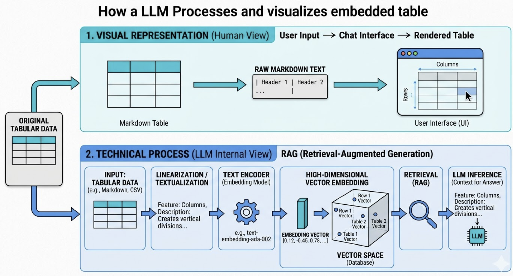

# AI Engineering - Week 3: Embeddings & Retrieval



This project explores the foundations of modern AI applications, focusing on how text is represented as vectors (embeddings) and how those vectors are used for semantic search, caching, and Retrieval-Augmented Generation (RAG).

## 🗺️ System Architecture
The following diagram illustrates the workflow from user query to cached results or a full RAG pipeline:

[Refer to 03_Vector_DBs_and_Embeddings_architecture.mmd]

## 🏗️ Architecture Breakdown

### 1. Semantic Caching (The Fast Path)
**Implemented in:** `[3.1]_semantic_cache.py`
Before performing a full search, we check if a similar question has been asked recently.
- **Semantic Cache**: Uses vector similarity to reuse previous answers even if the query isn't an exact match.
- **DE Equivalent**: Like a **Materialized View** or a **TTL-based Cache** (Redis) that stores pre-calculated results for expensive join queries.

### 2. Vectorization & Embedding
**Implemented in:** `[1.1]_Cosine_Similarity.py`, `[1.2]_Embeddings.py`, `[1.3]_vector.py`
We transform raw text into numerical representation.
- **Embedding Model**: Encodes semantic meaning into a high-dimensional vector.
- **DE Equivalent**: Like **Data Encoding** or **Hashing** specifically designed for similarity rather than exact matching.

### 3. Vector Search (The Retrieval)
**Implemented in:** `[2.1]_FAISS.py`, `[2.2]_chromeDB.py`
We search our databases for the most relevant pieces of information.
- **FAISS/ChromaDB**: Efficient high-dimensional indexing for similarity search.
- **DE Equivalent**: Like a **Database Index** optimized for `JOIN` operations across massive tables, but using distance metrics instead of primary keys.

### 4. RAG Pipeline (The Orchestrator)
**Implemented in:** `[4.1]_capstone_RAG.py`
We combine user intent with retrieved data to produce a grounded answer.
- **Augmented Prompt**: Merges the User Query + Retrieved Documents.
- **DE Equivalent**: Like a **Data Enrichment (Lookup)** step in an ETL pipeline where a source record is joined with master data before final loading.


## Key Components (Sorted)

### 1. Vector Foundations
- **`[1.1]_Cosine_Similarity.py`**: Measuring the semantic distance between two blocks of text.
- **`[1.2]_Embeddings.py`**: Transforming text into high-dimensional numerical arrays.
- **`[1.3]_vector.py`**: Core logic for vector representation.

### 2. Vector Databases
- **`[2.1]_FAISS.py`**: High-performance similarity search using Facebook AI Similarity Search.
- **`[2.2]_chromeDB.py`**: Implementing local vector storage using ChromaDB.

### 3. Semantic Caching
- **`[3.1]_semantic_cache.py`**: Intercepts queries to reduce costs and latency by reusing similar previous answers.

### 4. Capstone: RAG Pipeline
- **`[4.1]_capstone_RAG.py`**: A complete "Talk to your Data" implementation using Ollama and retrieved context.

## 🛠️ Tech Stack
- **Language**: Python 3.10+
- **Frameworks**: LangChain, sentence-transformers
- **Models**: Qwen 2.5 Coder (via Ollama)
- **Vector DB**: ChromaDB, FAISS

## Installation
```bash
pip install -r requirements.txt
```

## How to Run

### Option 1: Run the RAG Pipeline (Recommended)
This script demonstrates the full workflow: loading data, creating embeddings, searching, and generating an answer.
```bash
python 03_Vector_DBs_and_Embeddings/[4.1]_capstone_RAG.py
```

### Option 2: Test Semantic Caching
Test how the system reuses previous results.
```bash
python 03_Vector_DBs_and_Embeddings/[3.1]_semantic_cache.py
```