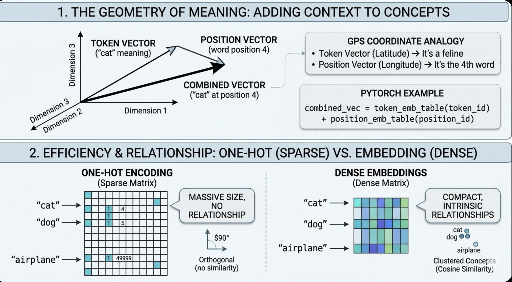

 Large Language Model (LLM) Definition
A Large Language Model (LLM) is a sophisticated neural network-based system, built primarily on the Transformer architecture, which uses statistical patterns learned from massive text datasets to predict the most probable next token (word, subword, or character) in a sequence. It operates like an incredibly advanced autocomplete engine, leveraging its parallel processing structure to understand and generate human-quality text by modeling the probabilistic relationships between words and contexts.


---

Common Dimensions by Model
Model	Embedding Dimension	Parameters
BERT-base	768	110M
GPT-2	1024	1.5B
GPT-3	12,288	175B
GPT-4 (estimated)	~16,000	~1.76T


-----


# LLM Key Jargons Explained

## 1. Vectors

Numerical representation of data.

**Example:**

```
Word "cat" → [0.2, -0.5, 0.8, 1.2, ..., -0.3]  (768 dimensions)
Image pixel → [255, 128, 64]  (RGB values)
```

**Why:** Computers need numbers; vectors encode meaning in multi-dimensional space.

**Properties:**
- Similar concepts have similar vectors
- "king" - "man" + "woman" ≈ "queen"

---

## 2. Embeddings (Word Embeddings)

An Embedding is a process or a look-up table. It maps discrete items (words/tokens) to continuous vector space.

**Example:**

​```python
vocab_size = 50,000
embedding_dim = 768

# Lookup table
embedding_table = nn.Embedding(50000, 768)

"hello" (token_id: 15277) → [0.23, -0.45, ..., 0.89]
​```




**Key concepts:**
- **Token embedding:** What the word means
- **Position embedding:** Where it appears in sequence
- **Combined:** `token_emb + position_emb` — both are added together because
  the word "not" means something very different depending on whether it appears
  before or after "good"

**Why embeddings not one-hot:**

One-hot encoding represents each word as a giant list of zeros with a single 1
at the word's position. If your vocabulary has 50,000 words, every word becomes
a list of 50,000 numbers — 49,999 of which are useless zeros.

​```
"cat" → [0, 0, 0, 1, 0, 0, ..., 0]   (position 4 is 1, rest are 0)
"dog" → [0, 0, 0, 0, 1, 0, ..., 0]   (position 5 is 1, rest are 0)
​```

The problem: "cat" and "dog" look completely unrelated to the model even though
both are animals. There is no way to tell that cat and dog are more similar to
each other than cat and airplane.

Embeddings fix both problems:
- One-hot: `[0,0,0,1,0,0,...,0]` — 50k dimensions, sparse, no meaning
- Embedding: `[0.2,-0.5,...,0.3]` — 768 dimensions, dense, learned

​```
"cat" → [0.2, -0.5, 0.8, ...]    (similar to dog!)
"dog" → [0.3, -0.4, 0.7, ...]    (similar to cat!)
"car" → [-0.9, 0.6, -0.2, ...]   (very different from both)
​```

Similar words end up with similar numbers — the model can now tell that cat
and dog are related concepts.


| Feature | Embedding | Vector |
|---------|-----------|--------|
| Nature | The Function or Table | The Data or Output |
| Analogy | The English-to-Math Dictionary | The specific page/definition |
| Example | nn.Embedding (The whole grid) | "[0.1, -0.5, 0.8] (One row)" |
| Role | Stores the relationships between all words | Represents one specific word's meaning |

---

## 3. ReLU (Rectified Linear Unit)

Activation function: converts negative values to zero.

**Formula:**

```
ReLU(x) = max(0, x)

Input:  [-2, -1, 0, 1, 2]
Output: [ 0,  0, 0, 1, 2]
```

**Why:**
- Introduces non-linearity (enables learning complex patterns)
- Fast to compute
- Prevents vanishing gradients

**Visual:**

```
│ /
│/
────┼──────
│
```

**Alternatives:**
- GELU (used in GPT): smoother version
- Sigmoid: squashes to [0, 1]
- Tanh: squashes to [-1, 1]

---

## 4. Embedding Space

High-dimensional space where similar items are close together.

**Example (2D simplified):**

```
    cat
     │
dog──┼──puppy
     │
  kitten

VS

car──truck
     │
  vehicle

Animals clustered, vehicles clustered
```

**Properties:**
- Semantic relationships preserved
- Can do vector math: `king - man + woman = queen`
- Distance = similarity

**Dimensions:**
- GPT: 768–12,288 dimensions
- Can't visualize, but math still works

---

## 5. Softmax

Converts arbitrary numbers to probabilities (sum to 1).

**Formula:**

```
softmax([x₁, x₂, x₃]) = [e^x₁, e^x₂, e^x₃] / sum

Example:
Input:  [2.0, 1.0, 0.1]
Output: [0.659, 0.242, 0.099]  ← Sum = 1.0
```

**Properties:**
- Larger inputs get larger probabilities
- All outputs positive
- Always sum to 1

**Use in LLMs:**
- Attention weights
- Next token prediction
- Classification tasks

**Temperature (optional parameter):**

```python
softmax(logits / temperature)

# Low temperature (0.0 - 0.3): Deterministic, focused
temperature = 0.1
"The capital of France is Paris."  # Always same answer

# Medium temperature (0.7 - 1.0): Balanced creativity
temperature = 0.8
"The capital of France is Paris, known for..."  # Varies slightly

# High temperature (1.5 - 2.0): Creative, random
temperature = 1.8
"The capital of France? Well, Paris obviously, but..."  # Very different each time

Temperature = 1.0: [0.7, 0.2, 0.1]   # Normal
Temperature = 0.5: [0.9, 0.08, 0.02] # Sharper (more confident)
Temperature = 2.0: [0.5, 0.3, 0.2]   # Softer (more random)

0.0 - 0.3: Code generation, factual Q&A, math
0.7 - 1.0: General conversation, writing
1.5+:      Creative writing, brainstorming
```

---

## 6. Logits

Raw, unnormalized scores before softmax.

**Example:**

```
Logits:        [2.5, 1.3, 0.8, -0.5, 3.1]  ← Model's raw output
                          ↓ softmax
Probabilities: [0.15, 0.05, 0.03, 0.01, 0.76]
```

**Why separate:**
- Logits: easier to compute loss
- Probabilities: easier to interpret

**In GPT:**

```python
logits = model(input)   # (B, T, vocab_size)
# Shape: (4, 8, 50257) - raw scores for each token

probs = softmax(logits)       # Convert to probabilities
next_token = sample(probs)    # Pick one
```

---

## 7. KV Cache

Optimization: cache Key and Value computations during generation.

**Without cache:**

```
Generate token 1: compute K,V for position 0
Generate token 2: compute K,V for positions 0,1    ← Recomputing!
Generate token 3: compute K,V for positions 0,1,2  ← Wasteful!
```

**With cache:**

```
Generate token 1: compute K,V for position 0, save
Generate token 2: reuse cached K,V[0], compute K,V[1], save
Generate token 3: reuse cached K,V[0,1], compute K,V[2], save
```

**Benefits:**
- 10–100x faster generation
- Memory tradeoff (store past K,V)

**Implementation:**

```python
# Store past keys and values
past_kv = [(k0, v0), (k1, v1), ...]

# Only compute new position
k_new = key(x_new)
v_new = value(x_new)

# Concatenate with past
k = concat(past_kv.keys, k_new)
v = concat(past_kv.values, v_new)
```

---

## 8. MLP (Multi-Layer Perceptron)

Fancy name for stacked linear layers with activations.

**Structure:**

```
Input → Linear → ReLU → Linear → Output
```

**In transformer (Feed-Forward):**

```
x → Linear(512→2048) → ReLU → Linear(2048→512) → x
      Expand 4x         Activate    Compress back
```

**Why "multi-layer":**
- Single layer = linear (can only learn lines)
- Multiple layers + activation = non-linear (learns curves, complex patterns)

**Example:**

```
Input: [0.5, -0.2, 0.8]
       ↓ Linear(3→6)
[0.2, -0.5, 0.1, 0.9, -0.3, 0.4]
       ↓ ReLU
[0.2,  0,   0.1, 0.9,  0,   0.4]  ← Negatives zeroed
       ↓ Linear(6→3)
[0.7, -0.1, 0.5]
```

---

## 9. Backpropagation

Algorithm to compute gradients (how to adjust weights).

**Chain rule applied backwards through network:**

```
Loss → Layer N → Layer N-1 → ... → Layer 1 → Inputs

Compute: ∂Loss/∂weights for each layer
```

**Example:**

```python
# Forward
x = 2.0
w = 3.0
y = w * x = 6.0
target = 10.0
loss = (y - target)^2 = 16.0

# Backward (backprop)
∂loss/∂y = 2(y - target) = -8
∂y/∂w   = x = 2.0
∂loss/∂w = ∂loss/∂y × ∂y/∂w = -8 × 2.0 = -16

# Update
w = w - lr × ∂loss/∂w
w = 3.0 - 0.01 × (-16) = 3.16  ← Improved!
```

**Why important:**
- How neural networks learn
- PyTorch automates this with `loss.backward()`

---

## 10. Dot Product

Multiply corresponding elements and sum.

**Formula:**

```
a · b = a₁b₁ + a₂b₂ + a₃b₃ + ...

Example:
a = [1, 2, 3]
b = [4, 5, 6]
a · b = 1×4 + 2×5 + 3×6 = 4 + 10 + 18 = 32
```

**Geometric meaning:**
- Measures similarity/alignment
- High value = vectors point same direction
- Zero = perpendicular
- Negative = opposite directions

**In attention:**

```
query · key = similarity score

q = [0.8, -0.2, 0.5]
k = [0.9,  0.1, 0.6]
score = 0.8×0.9 + (-0.2)×0.1 + 0.5×0.6 = 1.0  ← High similarity!
```

---

## 11. Cross-Entropy Loss

Measures difference between predicted and actual probability distributions.

**Formula:**

```
Loss = -Σ target_i × log(predicted_i)
```

**Example:**

```
Target: "cat"  (one-hot: [0, 1, 0, 0])
                           dog cat bird fish

Predicted probs: [0.1, 0.7, 0.1, 0.1]

Loss = -(0×log(0.1) + 1×log(0.7) + 0×log(0.1) + 0×log(0.1))
     = -log(0.7) = 0.36

Better prediction: [0.05, 0.9, 0.03, 0.02]
Loss = -log(0.9) = 0.11  ← Lower is better
```

**Properties:**
- Perfect prediction: loss = 0
- Wrong but confident: high loss
- Used for classification and language modeling

**In GPT:**

```python
logits  = model(input)               # (B×T, vocab_size)
targets = [1523, 4421, 832, ...]     # Actual next tokens

loss = F.cross_entropy(logits, targets)
# Penalizes wrong predictions
```

---

## 12. Perplexity

Measure of model uncertainty (lower = better).

**Formula:**

```
Perplexity = e^(cross_entropy_loss)

Loss = 2.5 → Perplexity = e^2.5 = 12.2
Loss = 1.0 → Perplexity = e^1.0 = 2.7
```

**Interpretation:**
- Perplexity = 12 means model is as confused as if choosing randomly from 12 options
- Perplexity = 2 means model is very confident (like binary choice)

**Example:**

```
Next word prediction:
Model A: perplexity = 50  (uncertain, 50-way confusion)
Model B: perplexity = 10  (better,    10-way confusion)
```

---

## 13. Input (in context of training)

Data fed to model.

**Forms:**

```
Text:      "The cat sat on the mat"
Tokenized: [450, 2368, 7372, 319, 262, 2603]
Embedded:  (B, T, C) tensor
```

**Batch structure:**

```
(batch_size, sequence_length, embedding_dim)
(32,         512,             768)

32 sentences
Each 512 tokens long
Each token is a 768-dimensional vector
```

---

## 14. Visual Explanations

### Attention Mechanism

```
Query (Q): "What am I looking for?"
Key   (K): "What do I contain?"
Value (V): "What information do I provide?"

Attention(Q,K,V) = softmax(QK^T / √d) × V

Process:
1. Compute similarity: Q · K^T
2. Scale: divide by √d  (prevents large values)
3. Softmax: convert to probabilities
4. Weight values: multiply by V
```

### Multi-Head Attention

```
Instead of one attention:

Head 1: learns syntax patterns
Head 2: learns semantic patterns
Head 3: learns positional patterns
...
Head 8: learns long-range dependencies

Concatenate all heads → project back
```

### Transformer Block

```
Input
  ↓
LayerNorm
  ↓
Multi-Head Attention
  ↓
Residual (+)
  ↓
LayerNorm
  ↓
Feed-Forward (MLP)
  ↓
Residual (+)
  ↓
Output (to next block)
```

### Self-Attention vs Cross-Attention

```
Self-Attention:
  Q, K, V all from same source
  "Tokens talking to each other"

Cross-Attention:
  Q from decoder
  K, V from encoder
  "Decoder attending to encoder"
```

---

## 15. Tokenization

The process of splitting raw text into subwords (not whole words). Each subword
is mapped to a numeric ID from a fixed vocabulary. The model never sees raw
text -- only integers.

```
"pipeline"  ->  ["pipe", "line"]  ->  [6870, 1370]
"Write SQL" ->  ["Write", "SQL"]  ->  [5234, 6826]
```

**Why subwords, not words?**
- A fixed vocabulary cannot contain every word in every language
- Subword tokenization handles unseen words by breaking them into known pieces
- Common words stay whole, rare words get split

**Vocabulary size:**
- GPT-2 / GPT-3: ~50,257 tokens
- The embedding table has one row per token in the vocabulary

---

## 16. LayerNorm (Layer Normalization)

Normalizes the values in a vector before passing them into attention or
feed-forward. Keeps numbers stable so training does not blow up across 96
layers.

```
Without LayerNorm:
  Layer 1 output:  [0.5, -0.3, 0.8]
  Layer 50 output: [4500, -2700, 8100]    <- exploding values
  Layer 96 output: [NaN, NaN, NaN]        <- training crashes

With LayerNorm:
  Layer 1 output:  [0.5, -0.3, 0.8]
  Layer 50 output: [0.6, -0.2, 0.9]      <- stable range
  Layer 96 output: [0.4, -0.5, 0.7]      <- still stable
```

**Where it appears in a transformer block:**
- Before multi-head attention
- Before feed-forward network

Each sub-layer is normalized independently so that numerical scale stays
consistent across the entire depth of the model.

---

## 17. Residual Connections (Skip Connections)

After every sub-layer (attention or feed-forward), the original input is added
back to the output.

```
x = x + attention(x)       <- first residual
x = x + feedforward(x)     <- second residual
```

**Why this matters:**

Without residual connections, gradients must travel through every single
operation in every layer during backpropagation. After 96 layers, the gradient
becomes vanishingly small and the model cannot learn.

With residual connections, the gradient has a "shortcut" -- it can flow straight
through the addition operation without being multiplied down. This is why 96+
layer models can train at all.

```
Without residuals:
  gradient passes through 96 matrix multiplications
  -> gradient vanishes -> early layers never learn

With residuals:
  gradient has a direct path through additions
  -> gradient stays healthy -> all layers learn
```

---

## 18. Unembedding

The reverse of embedding. After all transformer layers, the final vector of the
last token is multiplied by an unembedding matrix to produce one score per word
in the vocabulary.

```
Final vector: [0.34, -1.27, ..., 1.19]   (e.g. 12,288 dimensions)
                    |
                    v
       multiply by unembedding matrix
       (12,288 x 50,257)
                    |
                    v
       50,257 raw scores (logits)
       one per vocabulary word
                    |
                    v
       softmax -> probabilities
       "select" P=0.65, "fetch" P=0.18, ...
```

**Key detail:** Only the LAST token's vector is used. All the context from the
entire sequence has been compressed into that single vector through 96 layers of
attention.

---

## 19. Forward Pass (Autoregressive Generation)

How an LLM generates text: one token at a time, feeding each new token back
into the full model.

```
Step 1: Input "Write SQL to"
        -> full forward pass (all 96 layers)
        -> predict "select"

Step 2: Input "Write SQL to select"
        -> full forward pass (all 96 layers again)
        -> predict "all"

Step 3: Input "Write SQL to select all"
        -> full forward pass
        -> predict "from"

...continues until [END] token or max token limit
```

**Important:** Every single token requires a complete pass through all 96
layers. This is why generation is slow and why KV Cache (section 7) is critical
-- it avoids recomputing attention keys/values for tokens that have not changed.

**The word "autoregressive" means:** the model's own output becomes its next
input. It regresses on itself, one step at a time.

---

## 20. Context Window (Block Size)

The maximum number of tokens a model can process in a single forward pass. Any
tokens beyond this limit are simply not visible to the model.

```
GPT-2:       1,024 tokens
GPT-3:       4,096 tokens
GPT-4:     128,000 tokens
Claude 3:  200,000 tokens
```

**Why it is fixed:**
- The positional embedding table has a fixed number of rows
- The attention mechanism computes scores between every pair of tokens
- Memory grows quadratically: 2x tokens = 4x memory for attention

**What happens when you exceed it:**
- Early models: context is truncated (oldest tokens dropped)
- Modern models: use sliding windows or sparse attention to extend limits

**Practical impact:**
- Short context = model forgets earlier parts of long conversations
- Long context = model can read entire codebases or documents at once
- Cost scales with context length (more tokens = more compute = higher price)