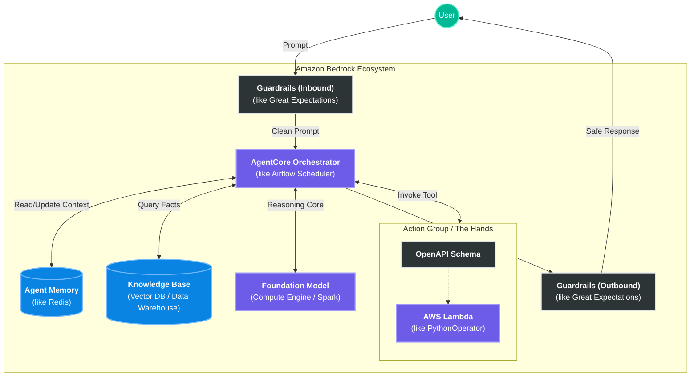

# AWS Bedrock Architecture & Components (Prerequisite Guide)

Before building agents on Amazon Bedrock, it is critical to understand its architecture. Bedrock is not a single AI model; it is a fully managed AWS service that provides a unified API to access multiple Foundation Models (FMs) and build agentic workflows around them.

This guide breaks down the core components of the Bedrock ecosystem using the standard Data Engineering translation matrix.

---

## 1. Foundation Models (FMs)
**The Engine**

*   **Simple definition**: The raw, underlying AI models you can choose to use (e.g., Claude 3.5, Amazon Titan, Llama 3).
*   **Technical context**: Bedrock abstracts the infrastructure required to host these models. You do not provision servers or GPUs; you simply call an API and pay per token. You can switch models by changing a single parameter in your code.
*   **Data Engineering Equivalent**: The compute engine (e.g., Spark Cluster, Snowflake Virtual Warehouse).

## 2. Agents for Amazon Bedrock (AgentCore)
**The Brain and Orchestrator**

*   **Simple definition**: The orchestrator that breaks down a user request into logical steps and decides what tools to use.
*   **Technical context**: AgentCore handles the complex prompt engineering required for tool-calling (ReAct pattern). It receives a prompt, evaluates available APIs and data sources, executes them in the correct sequence, and synthesizes the final response.
*   **Data Engineering Equivalent**: Airflow Scheduler / DAG Manager. It does not do the manual work; it coordinates the sequence of executable tasks.

## 3. Knowledge Bases
**The Reference Library**

*   **Simple definition**: A fully managed Retrieval-Augmented Generation (RAG) system that connects your private data to the agent.
*   **Technical context**: It automates the pipeline of reading files from S3, chunking the text, generating embeddings, and storing them in a vector database (like Amazon OpenSearch Serverless). When an agent receives a factual question, it queries the Knowledge Base to retrieve context before answering.
*   **Visual comparison**: Instead of manually building LangChain splitters, Pinecone indices, and retrieval loops, Knowledge Bases handles the entire ingestion and retrieval lifecycle natively.
*   **Data Engineering Equivalent**: Data Warehouse (Snowflake) + Automated ETL Pipeline (Fivetran).

## 4. Action Groups (Tools)
**The Hands**

*   **Simple definition**: The specific functions or APIs the agent is allowed to execute to interact with the outside world.
*   **Technical context**: An Action Group consists of two things: an OpenAPI Schema (a JSON file describing the endpoints and parameters) and an AWS Lambda function (the Python code that actually runs). The agent reads the schema to understand *how* to use the tool, and Bedrock handles invoking the Lambda.
*   **Data Engineering Equivalent**: Airflow `PythonOperator` or `BashOperator`. The actual execution units that perform discrete unit tests, API calls, or database queries.

## 5. Guardrails
**The Bouncer**

*   **Simple definition**: A mandatory safety filter that intercepts data going in and out of the model.
*   **Technical context**: Guardrails sit between the user and the Foundational Model. They evaluate the user's prompt (Input) and the model's response (Output) against predefined policies. If a user asks for PII (like a Social Security Number), the Guardrail masks it or blocks the transaction entirely, independent of the LLM's own alignment.
*   **Data Engineering Equivalent**: Data Quality Gates / Great Expectations. It ensures malformed or radioactive data does not enter or leave the pipeline.

## 6. Memory
**The Notebook**

*   **Simple definition**: The system that allows the agent to remember context across a multi-turn conversation.
*   **Technical context**: Without Memory, LLMs are stateless (they forget everything between API calls). Bedrock's AgentCore Memory can retain exact chat history for short-term interactions, and run background summarization to retain key facts for long-term sessions, saving tokens.
*   **Data Engineering Equivalent**: Redis Cache / Checkpoint State in Streaming.

---

## The Key Difference: Memory vs. Knowledge Base
Because they sound similar, they are easily confused. Here is how to distinguish them:

| Feature | Memory | Knowledge Base |
| :--- | :--- | :--- |
| **What it stores** | The actual conversation you are having *right now* (or had recently). | The files, PDFs, or wikis you uploaded *before* the conversation started. |
| **Scope** | **Personal/Session-based:** "My name is John" or "Remember that car we just talked about." | **Global/Factual:** "What is the company's return policy?" |
| **Data Engineering Equivalent** | **Redis (In-Memory Cache):** Fast, short-lived session state. | **Snowflake (Data Warehouse):** Persistent, historical reference data. |
| **Why both?** | So the agent knows *what you asked 5 minutes ago*. | So the agent knows *facts it wasn't trained on*. |

---

## How it All Connects (The Request Flow)

When a user sends a message to your Bedrock application, here is the lifecycle of that request:

1.  **User Input**: User types a prompt.
2.  **Guardrails (Inbound)**: The prompt is scanned for malicious injections or banned topics.
3.  **AgentCore (Orchestration)**: The agent receives the clean prompt and checks its **Memory** for past context.
4.  **Reasoning Loop**:
    *   *Does it need facts?* It queries the **Knowledge Base**.
    *   *Does it need to take action?* It reads the **Action Group** schema and invokes the associated **AWS Lambda**.
5.  **Synthesis**: The agent compiles the retrieved data and task results into a natural language answer.
6.  **Guardrails (Outbound)**: The response is scanned to ensure it isn't leaking PII or harmful text.
7.  **Final Output**: Returned to the user.

---

## Technology Stack Visualization

## How to Run
This is a conceptual document. There is no code to execute. Read this before starting Phase 1 in the AWS Bedrock guide to fully understand the terminology used in the console.
